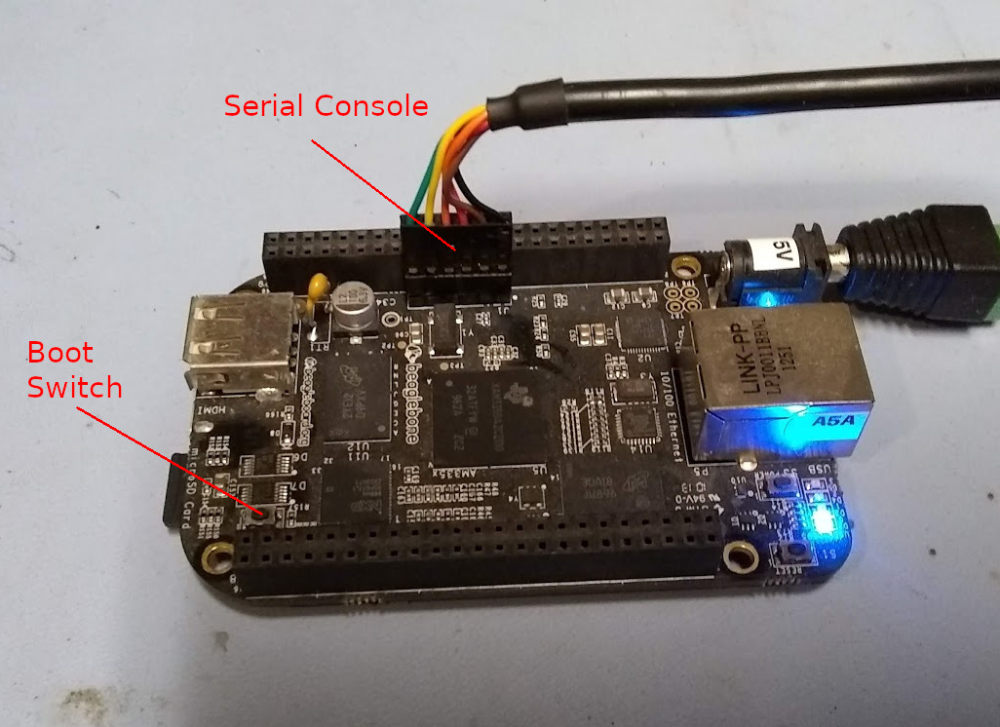

# Notes on using Yoe on the BeagleBone Black

[up](README.md)

[BSP Layer README](https://github.com/YoeDistro/meta-ti/blob/master/README)

[BeagleBone Black system reference manual](https://github.com/beagleboard/beaglebone-black/wiki/System-Reference-Manual)

## Building/installing an image

1. `git clone git://github.com/YoeDistro/yoe-distro.git`
1. `cd yoe-distro`
1. `. beaglebone-envsetup.sh`
1. `yoe_setup`
1. `bitbake yoe-simple-image`
1. insert SD card
1. `lsblk` (note sd card device, and substitute for /dev/sdX below)
1. `yoe_install_image /dev/sdX`
1. `cp deploy/beaglebone_0.0.1.upd /run/media/<SD card boot partition/`
1. `sudo eject /dev/sdX`
1. connect serial console (instructions below)
1. install SD card in a BeagleBone
1. hold the boot switch, apply power, and BeagleBone will now boot from SD card
   and install Yoe to the eMMC flash.
1. remove power and SD card. Yoe should now boot from eMMC disk.

## Connecting to serial console

The BeagleBone Black serial console is available on a 6-pin header as shown in
the image below. The pinout matches a standard
[3.3V FTDI 6-pin connector](https://www.ftdichip.com/Support/Documents/DataSheets/Cables/DS_TTL-232R_CABLES.pdf).

